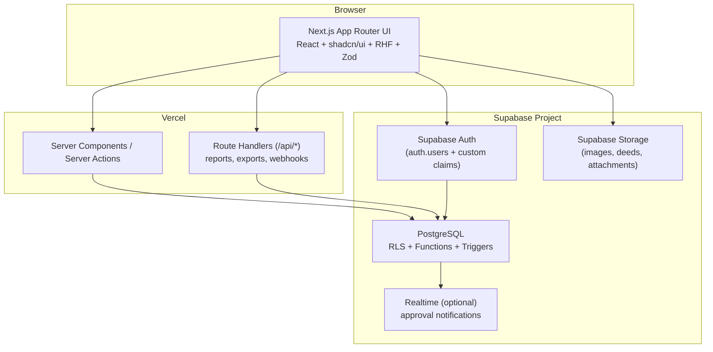

# System Architecture

## 1. Guiding principles

- **Multi-tenant, single database.** All companies live in one Postgres
  database, isolated by `company_id` + Row Level Security (RLS). This avoids
  N-database operational overhead while giving hard tenant isolation at the
  data layer (not just the app layer).
- **Everything is auditable.** No hard deletes on business data. Every
  mutating table carries `created_by/at`, `updated_by/at`, `deleted_by/at`,
  and business-approval columns (`approved_by/at`, `posted_by/at`). A
  generic trigger-based audit log captures old/new values for every insert,
  update, and delete on business tables.
- **Accounting is derived, not hand-entered.** Users interact with business
  documents (purchase, rent invoice, sale, receipt, payment...). The system
  is responsible for generating balanced journal entries from those
  documents. Nobody hand-picks debit/credit accounts except on the Journal
  Voucher screen itself.
- **Nothing posts unbalanced.** Debit = Credit is enforced at the database
  level (constraint/trigger), not just in the UI.
- **Everything expensive is server-side.** Report aggregation, currency
  conversion, numbering, and posting all happen in Postgres
  functions/RPCs or Next.js server actions — never trust the client for
  financial arithmetic.

## 2. High-level component diagram



## 3. Application layering

```
Presentation   -> app/ (Next.js routes, server components, forms)
Application    -> features/*/actions.ts (server actions), features/*/services.ts
Domain         -> Postgres functions/RPCs (numbering, posting, conversion, approval)
Data           -> Postgres tables + RLS policies
Cross-cutting  -> lib/auth, lib/permissions, lib/audit, lib/currency, lib/storage
```

Business logic that must be atomic and trusted (posting a voucher, currency
conversion, sequence generation, approval transitions) lives in **Postgres
functions (SECURITY DEFINER RPCs)**, callable via Supabase RPC. This ensures
correctness even if called from a script, a future mobile app, or directly
in SQL — not only from the Next.js app.

## 4. Multi-company (multi-tenancy) model

- `core.companies` — one row per legal entity/tenant.
- `core.user_companies` — many-to-many: a user may belong to multiple
  companies, with a default company.
- A custom **Auth Hook** (Supabase "Custom Access Token" hook) injects the
  user's active `company_id` and `role_ids` into the JWT `app_metadata` on
  login/refresh, and the UI lets the user switch active company (re-issues
  token / updates a session-scoped setting).
- RLS policies on every business table use a `SECURITY DEFINER` helper
  `core.current_company_id()` / `core.user_has_permission(module, action)`
  rather than duplicating logic per policy.
- No table is ever queried without an implicit `company_id = current_company_id()`
  filter enforced by RLS — the application layer never needs to (and must
  not rely on) filtering manually.

## 5. Authentication & RBAC

- **Auth**: Supabase Auth (email/password to start; architecture leaves
  room for SSO/OAuth later). `public.user_profiles` extends `auth.users`
  1:1 (full name, avatar, status, default company).
- **Roles** are company-scoped, admin-defined, unlimited in number
  (`core.roles`, e.g. Administrator, Accountant, Property Manager,
  Supervisor, Finance Manager).
- **Permissions** are per screen/module × action:
  `view | create | edit | delete | print | export | approve | reject | post`.
  Modeled as `core.permissions` (module_key, action) × `core.role_permissions`
  (role_id, permission_id, allowed boolean).
- A user's effective permissions = union of permissions across all roles
  assigned to them **within the active company** (`core.user_roles`).
- UI reads permissions once per session (server-side) and:
  1. Hides/disables buttons/menus the user can't use.
  2. Server actions/RPCs re-check permissions server-side regardless of UI
     state (defense in depth — UI checks are UX only, never the security
     boundary).

## 6. Multi-level voucher approval engine

Generic, configurable, reusable across **every** voucher type (Purchase,
UAE/PK Rent Invoice, Sale, Receipt, Payment, JV, PDC, etc.), not hardcoded
per module:

- `accounting.approval_workflows` — one per (company, voucher_type),
  active/inactive.
- `accounting.approval_workflow_steps` — ordered levels; each step defines
  an approver by **role** (e.g. "Manager") and optionally a minimum
  amount threshold (so e.g. only vouchers > 100,000 need a 2nd level).
- `accounting.voucher_approvals` — one row per voucher instance, tracking
  `current_step`, `status` (`draft → pending → approved → posted`,
  or `rejected`, `sent_back`), polymorphic reference
  (`voucher_type`, `voucher_id`).
- `accounting.voucher_approval_actions` — immutable action log
  (approve/reject/send back, actor, comment, timestamp) — this **is** the
  audit trail for the approval process.
- State machine (enforced by a Postgres function
  `accounting.transition_voucher_status()`):
  `draft -> pending -> (approved -> posted) | rejected | sent_back -> draft`.
  Only `posted` vouchers create/finalize journal entries and affect
  balances; `draft`/`pending` vouchers never touch ledgers.

## 7. Double-entry accounting engine

- Every posted business document creates one `accounting.journal_entries`
  header + N `accounting.journal_entry_lines`.
- A trigger (`accounting.enforce_balanced_entry`) blocks any journal entry
  from being marked `posted` unless
  `SUM(debit_amount) = SUM(credit_amount)` (compared in **base currency**,
  rounded to a fixed precision).
- Journal entries are **never edited** once posted; corrections are made via
  reversing/adjusting Journal Vouchers (full audit trail, standard
  accounting practice).
- Each module's "automatic accounting entries" (Purchase, Sale, Rent
  Invoice, Receipt, Payment...) are generated by a per-voucher-type Postgres
  function that maps the document to a template of account lines (e.g.
  Purchase → Dr Asset/Cost Center, Dr Tax Input, Cr Supplier Payable, Cr
  Cash/Bank for immediate expenses), so the mapping is data-driven
  (`accounting.posting_templates`) rather than duplicated per feature.

## 8. Multi-currency architecture

- `core.currencies` — currency master (code, name, symbol, decimal places).
- One currency per company flagged `is_base_currency`.
- `core.exchange_rates` — daily rates (`currency_id`, `rate_date`,
  `rate_to_base`), append-only (historical rates are never overwritten,
  only superseded by a newer `rate_date`).
- Every transactional table that carries money stores **both**:
  `currency_id`, `exchange_rate`, `transaction_amount` (in transaction
  currency) **and** `base_amount` (transaction_amount × exchange_rate,
  computed at posting time and frozen — never recalculated retroactively).
- Chart of Accounts entries may optionally be currency-restricted
  (`account_currency_id`) for banks/foreign payables; postings to such
  accounts also freeze the historical rate.
- All reports accept a `currency_mode` parameter: `base` or `account`
  (native transaction currency), computed via a shared
  `accounting.fn_convert_amount()` helper — one implementation, used
  everywhere, so conversion logic never drifts between reports.

## 9. Audit trail

- Generic trigger `audit.fn_row_audit()` attached to every business table,
  writing to `audit.audit_logs` (`table_name`, `row_id`, `action`
  (`INSERT/UPDATE/DELETE`), `old_data jsonb`, `new_data jsonb`, `changed_by`,
  `changed_at`, `company_id`).
- Approval/posting actions are additionally recorded in
  `accounting.voucher_approval_actions` (business-level audit, human
  readable) — the generic table audit log is the technical/forensic layer.
- Soft delete only: business tables use `deleted_at`/`deleted_by`; RLS
  policies exclude soft-deleted rows from normal `SELECT`s by default.

## 10. File management

- Supabase Storage buckets, one per document category, private by default:
  `asset-images`, `title-deeds`, `agreements`, `receipts`, `attachments`.
- `core.attachments` — polymorphic metadata table
  (`entity_type`, `entity_id`, `bucket`, `path`, `file_name`, `mime_type`,
  `size_bytes`, `uploaded_by`, `uploaded_at`) so every module reuses the
  same upload/list/delete component and RLS-checked signed URLs, instead of
  each module inventing its own attachment table.

## 11. Auto numbering

- `core.document_sequences` (`company_id`, `voucher_type`, `prefix`,
  `padding`, `next_number`, `reset_policy`: `never|yearly|monthly`).
- `core.fn_next_document_number(company_id, voucher_type)` — a
  `SECURITY DEFINER` function using row-level locking
  (`SELECT ... FOR UPDATE`) on the sequence row to hand out numbers like
  `PV-000001` atomically and without gaps/collisions under concurrency.
  Prefixes are admin-configurable per company.

## 12. Reporting strategy

- Core financial reports (General Ledger, Trial Balance, Balance Sheet,
  P&L, Cash Book, Bank Book) are built on top of a single reusable
  `accounting.v_ledger_entries` view (posted journal lines joined to
  account, cost center, currency), parameterized by date range, company,
  cost center, and currency mode — not one bespoke query per report.
- Operational reports (Asset Register, Valuation, Purchase/Sale, Rental
  Income, Outstanding Rent, Currency Exchange, Voucher Register) each get a
  dedicated view/RPC in their owning module's schema.
- PDF export via a server-side rendering route (`/api/reports/[type]/pdf`);
  Excel export via a shared `lib/export/xlsx.ts` utility. Both consume the
  same underlying report RPC the on-screen table uses, so exports can never
  drift from what's displayed.

## 13. Deployment

- Vercel project per environment (Preview per PR, Production on `main`).
- Supabase project per environment (or schema-per-branch if using Supabase
  branching), migrations applied via the Supabase CLI in CI before deploy.
- Environment variables: `NEXT_PUBLIC_SUPABASE_URL`,
  `NEXT_PUBLIC_SUPABASE_ANON_KEY`, `SUPABASE_SERVICE_ROLE_KEY` (server-only,
  never exposed to the client bundle).
