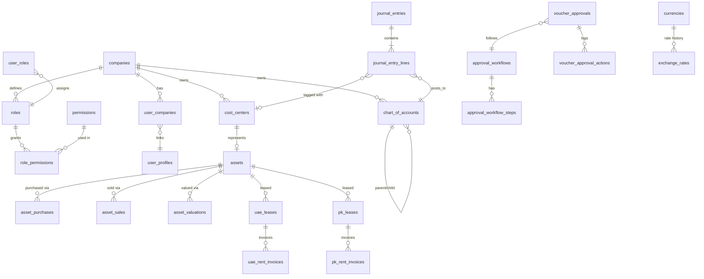

# Database Schema (Conceptual Blueprint)

This is the master data model referenced by every module. Actual
`CREATE TABLE` migrations, indexes, constraints, and RLS policies are
delivered **per module** (per the roadmap), always consistent with this
blueprint. All tables use `uuid` primary keys (`gen_random_uuid()`), and all
business tables include the common audit columns defined in §0.

Postgres schemas (namespaces) used, mirroring the module boundaries:

| Schema       | Purpose                                              |
|--------------|-------------------------------------------------------|
| `core`       | Companies, users, roles/permissions, currencies, sequences, attachments |
| `audit`      | Generic audit log                                     |
| `accounting` | Chart of accounts, cost centers, journal engine, all vouchers, approval engine |
| `assets`     | Asset registration, purchase, valuation, sale          |
| `rental`     | UAE and Pakistan leases/invoices                       |
| `reporting`  | Views/materialized views backing reports               |

## 0. Common audit columns (every business table)

```
id               uuid primary key default gen_random_uuid()
company_id       uuid not null references core.companies(id)
created_by       uuid not null references auth.users(id)
created_at       timestamptz not null default now()
updated_by       uuid references auth.users(id)
updated_at       timestamptz
deleted_by       uuid references auth.users(id)
deleted_at       timestamptz            -- soft delete
```

Vouchers additionally carry:

```
status           text not null default 'draft'  -- draft|pending|approved|posted|rejected|sent_back
approved_by      uuid references auth.users(id)
approved_at      timestamptz
posted_by        uuid references auth.users(id)
posted_at        timestamptz
```

---

## 1. `core` schema

| Table | Key columns | Notes |
|---|---|---|
| `companies` | code, name, country, base_currency_id, address, logo_path, is_active | one row per tenant |
| `user_profiles` | id (=auth.users.id), full_name, phone, avatar_path, is_active, default_company_id | 1:1 with `auth.users` |
| `user_companies` | user_id, company_id, is_default | user↔company membership |
| `roles` | company_id, name, description, is_system_role, is_active | unlimited, company-scoped |
| `permissions` | module_key, action, label | static catalog: `(assets, view)`, `(assets, create)`, `(purchase_voucher, post)`, ... for every screen × action in {view, create, edit, delete, print, export, approve, reject, post} |
| `role_permissions` | role_id, permission_id, allowed | grants |
| `user_roles` | user_id, role_id, company_id | role assignment (company-scoped) |
| `currencies` | code (ISO 4217), name, symbol, decimal_places, is_active | e.g. PKR, AED, USD |
| `company_currencies` | company_id, currency_id, is_base_currency | base currency per company |
| `exchange_rates` | currency_id, rate_date, rate_to_base, source, created_by | append-only, unique (currency_id, rate_date) |
| `document_sequences` | company_id, voucher_type, prefix, padding, next_number, reset_policy | atomic numbering |
| `attachments` | entity_type, entity_id, bucket, path, file_name, mime_type, size_bytes, uploaded_by | polymorphic file metadata |
| `system_settings` | company_id, key, value (jsonb) | per-company configuration |

## 2. `audit` schema

| Table | Key columns | Notes |
|---|---|---|
| `audit_logs` | table_name, row_id, action (INSERT/UPDATE/DELETE), old_data jsonb, new_data jsonb, changed_by, changed_at, company_id | generic trigger-driven log across all business tables |

## 3. `accounting` schema

### Chart of Accounts & Cost Centers

| Table | Key columns | Notes |
|---|---|---|
| `chart_of_accounts` | company_id, account_code (unique per company), account_name, parent_id (self-FK), account_type (`asset\|liability\|income\|expense\|equity`), currency_id (nullable = multi-currency), opening_balance, opening_balance_currency_id, is_group, is_active | unlimited-level tree via `parent_id`; `is_group` = header/non-postable node |
| `cost_centers` | company_id, code, name, asset_id (FK → `assets.assets`, nullable until asset created), country, city, property_type, building, plot_number, owner, rental_status, is_active | one cost center per registered asset |

### Journal Engine (the core of double-entry accounting)

| Table | Key columns | Notes |
|---|---|---|
| `journal_entries` | company_id, entry_date, voucher_type, voucher_id (polymorphic), currency_id, exchange_rate, narration, status | header |
| `journal_entry_lines` | journal_entry_id, line_no, account_id, cost_center_id, debit_amount, credit_amount, currency_id, exchange_rate, base_debit_amount, base_credit_amount, description | Σdebit = Σcredit enforced by trigger before `posted` |
| `posting_templates` | company_id, voucher_type, line_no, account_role (e.g. `supplier_payable`, `tax_input`, `cash_bank`), debit_or_credit, account_id (or rule to resolve dynamically) | data-driven mapping so each voucher type's auto journal entry is configured, not hardcoded |

### Approval Engine (generic, reused by every voucher type)

| Table | Key columns | Notes |
|---|---|---|
| `approval_workflows` | company_id, voucher_type, is_active | one workflow per (company, voucher type) |
| `approval_workflow_steps` | workflow_id, step_order, approver_role_id, min_amount, max_amount | configurable levels + amount thresholds |
| `voucher_approvals` | voucher_type, voucher_id, workflow_id, current_step, status | one per voucher instance |
| `voucher_approval_actions` | voucher_approval_id, step_order, action (`approve\|reject\|send_back`), actor_id, comment, acted_at | immutable action log |

### Vouchers

| Table | Key columns | Notes |
|---|---|---|
| `purchase_vouchers` | voucher_no, supplier_id, purchase_date, currency_id, exchange_rate, asset_id, purchase_price, taxes, registration_charges, additional_expenses, total_amount | → `assets.asset_purchases` detail, generates JE via posting template |
| `receipt_vouchers` | voucher_no, receipt_date, received_from, account_id (cash/bank), currency_id, exchange_rate, amount, against_type, against_id, narration | against invoice/lease/other |
| `payment_vouchers` | voucher_no, payment_date, paid_to, account_id (cash/bank), currency_id, exchange_rate, amount, against_type, against_id, narration | |
| `pdc_payment_vouchers` | voucher_no, cheque_no, bank_account_id, payee, cheque_date, amount, currency_id, status (`pending\|cleared\|returned\|cancelled`) | post-dated cheque (payable) |
| `pdc_receipt_vouchers` | voucher_no, cheque_no, bank_account_id, payer, cheque_date, amount, currency_id, status | post-dated cheque (receivable) |
| `cheque_return_vouchers` | voucher_no, original_pdc_type, original_pdc_id, return_date, return_reason, penalty_amount | reverses the PDC's provisional entry |
| `journal_vouchers` | voucher_no, entry_date, narration | manual JV → 1:1 with a `journal_entries` header |
| `jv_maintenance_vouchers` | voucher_no, original_jv_id, adjustment_reason | correcting/reversing entries against a posted JV |
| `opening_balance_vouchers` | voucher_no, as_of_date, account_id, currency_id, debit_amount, credit_amount | initial trial balance load |

## 4. `assets` schema

| Table | Key columns | Notes |
|---|---|---|
| `assets` | asset_code (unique/company), asset_name, property_type, country (`PK\|AE`), city, area, address, purchase_date, purchase_value, current_value, status (`active\|sold\|inactive`), owner, title_deed_attachment_id, notes | drives creation of a matching `accounting.cost_centers` row |
| `asset_purchases` | asset_id, purchase_voucher_id, supplier_id, currency_id, exchange_rate, purchase_price, taxes, registration_charges, additional_expenses | detail behind `accounting.purchase_vouchers` |
| `asset_valuations` | asset_id, valuation_date, market_value, valuer, notes | reporting-only, never touches ledgers (per spec) |
| `asset_sales` | asset_id, sale_voucher_no, sale_date, buyer, sale_price, book_value_at_sale, profit_loss_amount, capital_gain_amount, currency_id, exchange_rate | triggers JE + sets `assets.status = 'sold'` |
| `asset_images` | asset_id, attachment_id, is_primary | via `core.attachments` |

## 5. `rental` schema

### UAE

| Table | Key columns | Notes |
|---|---|---|
| `uae_leases` | asset_id, tenant_id, lease_start, lease_end, rental_amount, rent_cycle (`monthly\|yearly`), security_deposit, currency_id, status | |
| `uae_payment_schedules` | lease_id, due_date, amount, status (`pending\|invoiced\|paid\|overdue`) | generated from lease terms |
| `uae_rent_invoices` | invoice_no, lease_id, invoice_date, due_date, period_start, period_end, amount, currency_id, exchange_rate, outstanding_balance, status | generates JE (Dr Tenant Receivable / Cr Rental Income) |

### Pakistan

| Table | Key columns | Notes |
|---|---|---|
| `pk_leases` | asset_id, tenant_id, lease_start, lease_end, monthly_rent, advance_rent, security_deposit, currency_id, status | |
| `pk_rent_invoices` | invoice_no, lease_id, invoice_date, due_date, rent_amount, utility_charges, advance_adjusted, outstanding_amount, currency_id, status | |
| `pk_utility_charges` | invoice_id, utility_type, amount | electricity/gas/water etc. |

### Shared

| Table | Key columns | Notes |
|---|---|---|
| `tenants` | company_id, name, cnic_or_emirates_id, phone, email, address | shared master between PK/UAE |

## 6. `reporting` schema

| View | Backs |
|---|---|
| `v_ledger_entries` | GL, Trial Balance, Balance Sheet, P&L, Cash Book, Bank Book |
| `v_asset_register` | Asset Register report |
| `v_asset_valuation` | Asset Valuation report |
| `v_rental_income` | Rental Income report (UAE + PK union) |
| `v_outstanding_rent` | Outstanding Rent report |
| `v_currency_exchange_history` | Currency Exchange report |
| `v_voucher_register` | Voucher Register (all voucher types unioned) |

## 7. Entity relationship overview (core + accounting backbone)



## 8. Cross-cutting rules baked into the schema

- **Uniqueness**: `(company_id, account_code)`, `(company_id, voucher_type, voucher_no)`,
  `(currency_id, rate_date)`, `(company_id, asset_code)` are all unique
  constraints, not just app-level checks — prevents duplicate account/voucher
  numbers even under concurrent writes.
- **Referential integrity**: all FKs `on delete restrict` by default (soft
  delete is used instead of hard delete for anything referenced by
  financial history).
- **Checks**: `debit_amount >= 0 and credit_amount >= 0` and
  `not (debit_amount > 0 and credit_amount > 0)` per line;
  `exchange_rate > 0`; `lease_end > lease_start`; `sale_date >= purchase_date`.
- **Indexes**: every FK column, every `(company_id, ...)` composite used in
  RLS predicates, and date columns used in report filtering
  (`entry_date`, `invoice_date`, `rate_date`).
